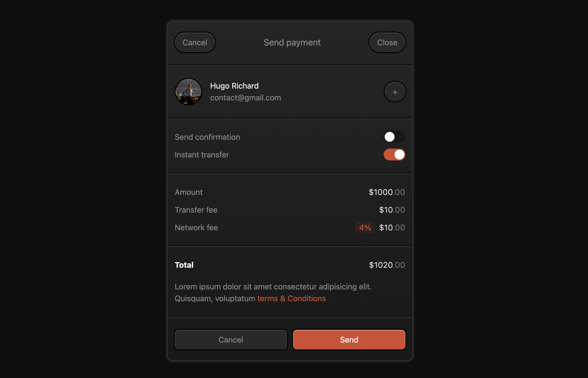

# @Hanifalhafizh10 Checkout Form Inspired

Here is a delightful checkout form built using Nuxt.js and Tailwind CSS. It was inspired by a Twitter post from [@JimDesignsCo](https://x.com/jimdesignsco). You can find the post [here](https://twitter.com/JimDesignsCo/status/1737474070801691136).

Feel free to customize all the colors in the `tailwind.config.ts` and `main.css` files.

Make sure to visit the original creator's profile: [@Hanifalhafizh10](https://x.com/hanifalhafizh10). He is an incredibly talented designer.

## Setup

Make sure to install the dependencies:

```bash
# bun
bun install

# npm
npm install

# pnpm
pnpm install

# yarn
yarn install
```

## Development Server

Start the development server on `http://localhost:3000`:

```bash
# bun
bun run dev

# npm
npm run dev

# pnpm
pnpm run dev

# yarn
yarn dev

```
